# Signalist

Signalist is a full-stack stock-market dashboard for discovering companies, building a personal watchlist, viewing TradingView market intelligence, tracking prices, and receiving AI-personalized market emails.

It combines a responsive Next.js interface with Better Auth, MongoDB Atlas, Finnhub, Alpha Vantage, TradingView widgets, Inngest background jobs, Gemini-generated summaries, and Nodemailer email delivery.

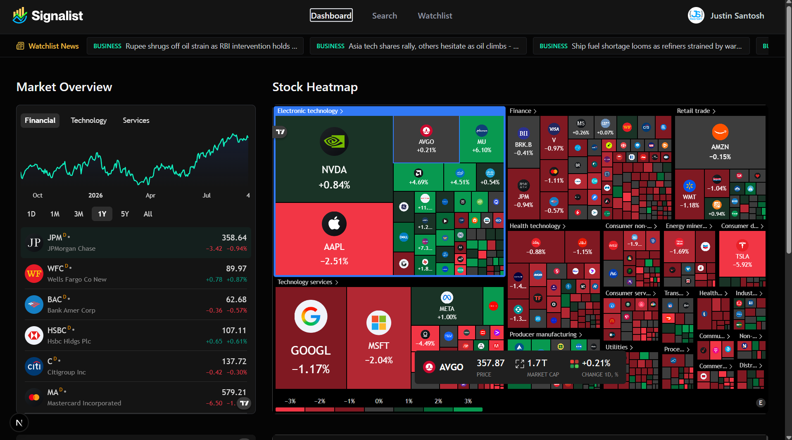

## Contents

- [What Signalist does](#what-signalist-does)
- [Feature tour](#feature-tour)
- [Product gallery](#product-gallery)
- [Technology stack](#technology-stack)
- [System architecture](#system-architecture)
- [Application flows](#application-flows)
- [UML-style diagrams](#uml-style-diagrams)
- [External integrations](#external-integrations)
- [Project structure](#project-structure)
- [Getting started](#getting-started)
- [Environment variables](#environment-variables)
- [Background jobs and email](#background-jobs-and-email)
- [Data model](#data-model)
- [Security and reliability](#security-and-reliability)
- [Available scripts](#available-scripts)
- [Known limitations](#known-limitations)
- [Roadmap](#roadmap)

## What Signalist does

Signalist gives authenticated users one place to:

- Explore a global market overview, stock heatmap, market quotes, and top stories.
- Search for supported stocks and open symbol-specific analysis pages.
- Build a MongoDB-backed personal watchlist.
- View live quote data, percentage change, market capitalization, and P/E ratio.
- Read company-specific news in cards and in a continuously scrolling headline ticker.
- Create browser-persisted price-alert rules from the watchlist interface.
- Inspect advanced charts, technical analysis, company profiles, and financial statements.
- Receive a personalized welcome email after registration.
- Receive scheduled AI-generated market-news digests based on watchlist symbols.

## Feature tour

### Market dashboard

The dashboard embeds TradingView widgets for market overview, market heatmaps, top stories, and market quotes. Each widget is isolated in a reusable React component and configured centrally.

### Personalized news ticker

The header loads news related to the signed-in user's watchlist. Headlines move continuously from right to left, pause on hover, and stop animating when the operating system requests reduced motion.

### Watchlist and price monitoring

Watchlist membership is stored per user in MongoDB Atlas. The watchlist screen enriches stored symbols with fresh Finnhub quotes, company profiles, valuation metrics, and related news.

Price-alert rules created in the current UI are stored in browser `localStorage`. They are useful for the dashboard experience, but they are not yet server-side notification jobs.

### Stock detail workspace

Each `/stocks/[symbol]` route assembles TradingView widgets for:

- Symbol information
- Candlestick charting
- Baseline performance
- Technical analysis
- Company profile
- Company financials

### Source article experience

News cards and ticker items link to the original publisher in a new tab. The publisher is determined by the article returned by the configured market-news provider.

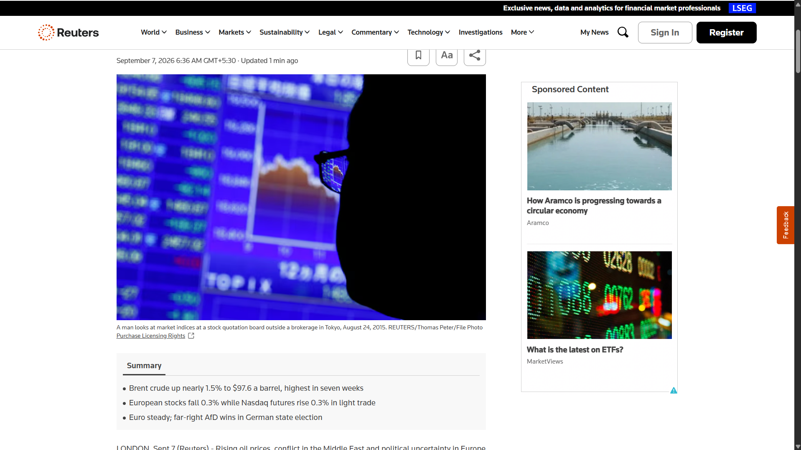

## Product gallery

### Market stories and quotes

The dashboard pairs TradingView's top-stories widget with a categorized market-quotes view, while the persistent watchlist-news ticker keeps relevant headlines in view.

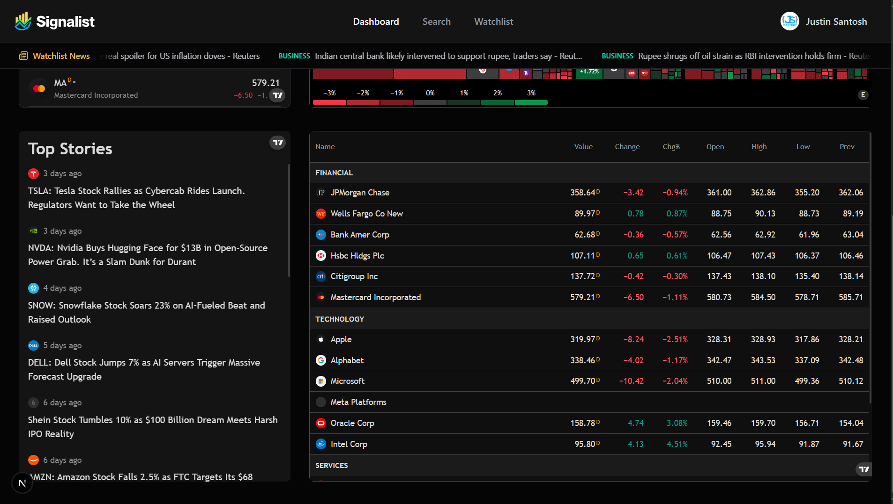

### Watchlist overview

The watchlist brings saved companies, provider-enriched market data, locally saved price-rule controls, and personalized news into one workspace.

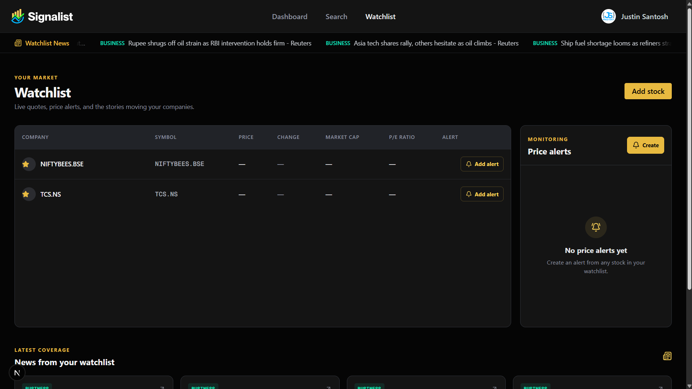

### Watchlist news coverage

The article cards display the source, recency, related symbol/category, short summary, and a direct link to the original publisher.

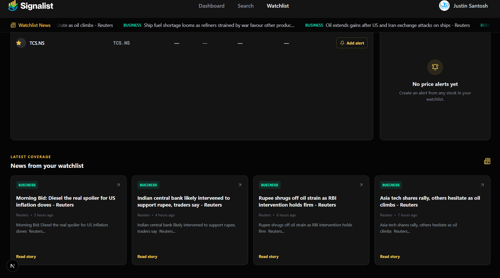

### Stock analysis

The stock-detail route combines TradingView symbol information, charting, technical analysis, and financial widgets for a selected symbol.

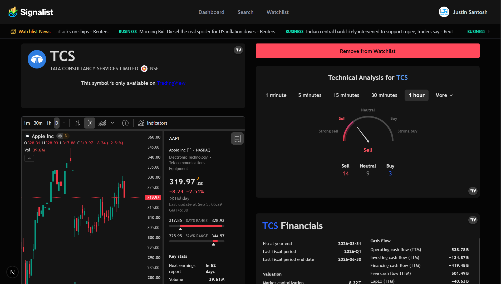

### Company financials

The financials widget provides a focused view of valuation, cash-flow, profitability, efficiency, and income-statement data where TradingView supports the selected symbol.

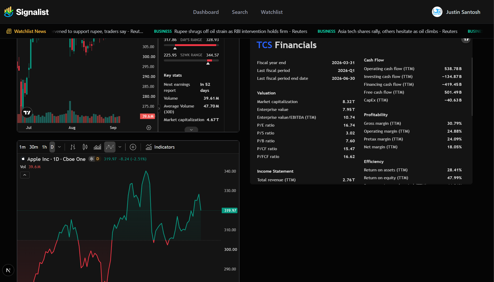

## Technology stack

| Layer | Technology | How it is used |
| --- | --- | --- |
| Application | Next.js 15 App Router | Server-rendered routes, layouts, route handlers, and server actions |
| Language | TypeScript | Shared types for users, stocks, watchlists, news, quotes, and alerts |
| UI | React 19 | Client interactions and reusable components |
| Styling | Tailwind CSS 4 + custom CSS | Responsive dark theme, ticker animation, dashboard layout, and utility styling |
| Components | shadcn/ui + Radix UI | Accessible dialogs, commands, dropdowns, selects, popovers, avatars, inputs, and buttons |
| Icons | Lucide React | Navigation, watchlist, alerts, news, and action icons |
| Authentication | Better Auth | Email/password registration, sign-in, sign-out, sessions, and protected-route access |
| Database | MongoDB Atlas | Better Auth collections and persistent user watchlists |
| ODM | Mongoose | Connection reuse, schema validation, watchlist queries, and compound uniqueness |
| Market data | Finnhub | Stock search, company profiles, quotes, metrics, and company/general news |
| Data fallback | Alpha Vantage | Indian-market symbol search and news fallback when Finnhub results are unavailable |
| Charts | TradingView widgets | Market overview, heatmap, quotes, timelines, charts, technicals, profiles, and financials |
| Background jobs | Inngest | Event-driven welcome mail and scheduled daily-news workflows |
| AI | Gemini through Inngest | Personalized welcome copy and per-user market-news summaries |
| Email | Nodemailer + Gmail SMTP | HTML welcome messages and daily digest delivery |
| Forms | React Hook Form | Typed authentication form state and validation |
| Notifications | Sonner | User-facing success and error toasts |

## System architecture

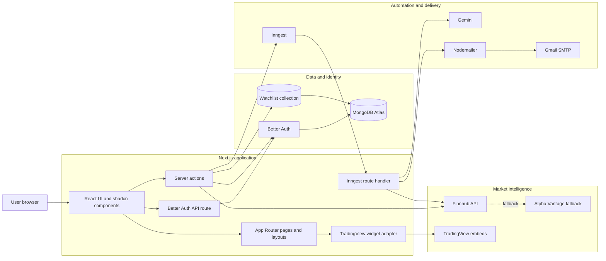
```mermaid
flowchart LR
    User[User browser]

    subgraph Web[Next.js application]
        UI[React UI and shadcn components]
        RSC[App Router pages and layouts]
        Actions[Server actions]
        AuthRoute[Better Auth API route]
        JobRoute[Inngest route handler]
        TVAdapter[TradingView widget adapter]
    end

    subgraph Data[Data and identity]
        BetterAuth[Better Auth]
        Mongo[(MongoDB Atlas)]
        Watchlist[(Watchlist collection)]
    end

    subgraph Markets[Market intelligence]
        Finnhub[Finnhub API]
        Alpha[Alpha Vantage fallback]
        TradingView[TradingView embeds]
    end

    subgraph Automation[Automation and delivery]
        Inngest[Inngest]
        Gemini[Gemini]
        Nodemailer[Nodemailer]
        Gmail[Gmail SMTP]
    end

    User --> UI
    UI --> RSC
    UI --> Actions
    UI --> AuthRoute
    RSC --> TVAdapter --> TradingView
    AuthRoute --> BetterAuth --> Mongo
    Actions --> BetterAuth
    Actions --> Watchlist
    Watchlist --> Mongo
    Actions --> Finnhub
    Finnhub -. fallback .-> Alpha
    Actions --> Inngest
    Inngest --> JobRoute
    JobRoute --> Gemini
    JobRoute --> Finnhub
    JobRoute --> Nodemailer --> Gmail
```

### Request and data-flow overview

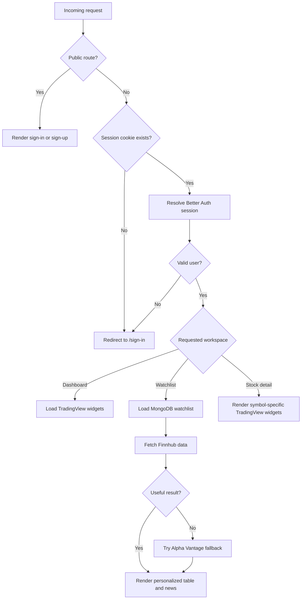
```mermaid
flowchart TD
    Request[Incoming request] --> Public{Public route?}
    Public -- Yes --> AuthPage[Render sign-in or sign-up]
    Public -- No --> Cookie{Session cookie exists?}
    Cookie -- No --> Redirect[Redirect to /sign-in]
    Cookie -- Yes --> Session[Resolve Better Auth session]
    Session --> Valid{Valid user?}
    Valid -- No --> Redirect
    Valid -- Yes --> Route{Requested workspace}
    Route -- Dashboard --> TV[Load TradingView widgets]
    Route -- Watchlist --> WL[Load MongoDB watchlist]
    WL --> Market[Fetch Finnhub data]
    Market --> Result{Useful result?}
    Result -- No --> AV[Try Alpha Vantage fallback]
    Result -- Yes --> Personal[Render personalized table and news]
    AV --> Personal
    Route -- Stock detail --> Symbol[Render symbol-specific TradingView widgets]
```

## Application flows

### Sign-up and welcome-email sequence

The account is created synchronously so the user can continue immediately. Email generation and delivery are moved to Inngest, keeping AI and SMTP latency out of the browser request.

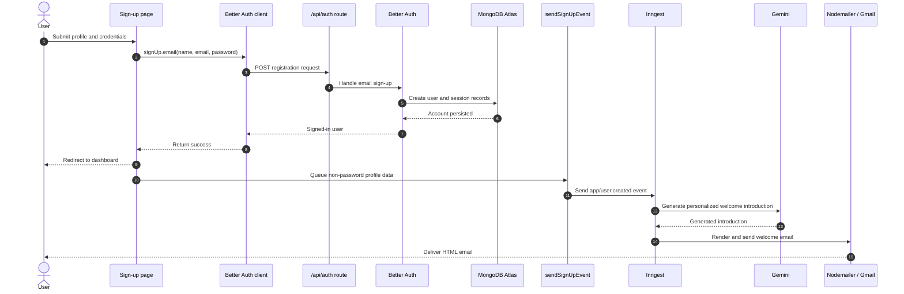
```mermaid
sequenceDiagram
    autonumber
    actor User
    participant Form as Sign-up page
    participant Client as Better Auth client
    participant AuthRoute as /api/auth route
    participant Auth as Better Auth
    participant DB as MongoDB Atlas
    participant EventAction as sendSignUpEvent
    participant Inngest
    participant Gemini
    participant Mail as Nodemailer / Gmail

    User->>Form: Submit profile and credentials
    Form->>Client: signUp.email(name, email, password)
    Client->>AuthRoute: POST registration request
    AuthRoute->>Auth: Handle email sign-up
    Auth->>DB: Create user and session records
    DB-->>Auth: Account persisted
    Auth-->>Client: Signed-in user
    Client-->>Form: Return success
    Form-->>User: Redirect to dashboard
    Form->>EventAction: Queue non-password profile data
    EventAction->>Inngest: Send app/user.created event
    Inngest->>Gemini: Generate personalized welcome introduction
    Gemini-->>Inngest: Generated introduction
    Inngest->>Mail: Render and send welcome email
    Mail-->>User: Deliver HTML email
```

The rendered sign-up flow is also available as a static diagram:

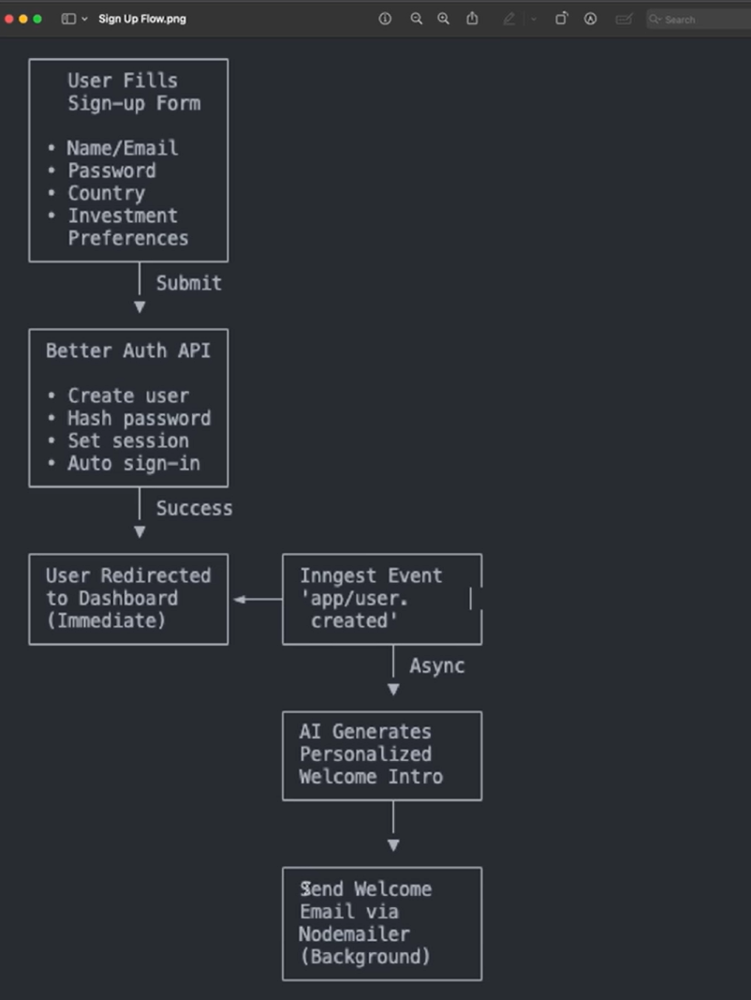

### Watchlist page sequence

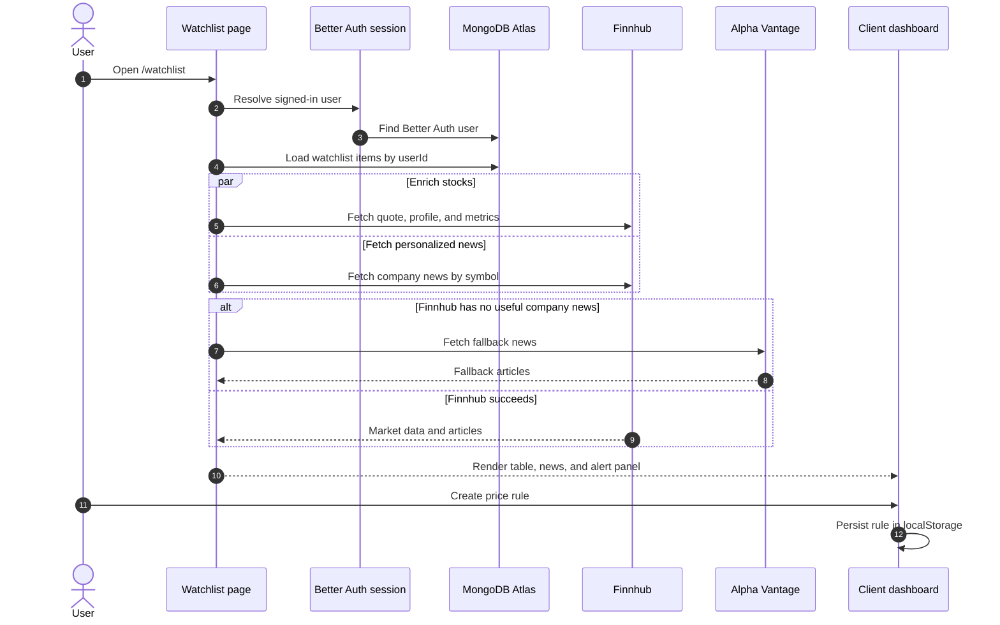
```mermaid
sequenceDiagram
    autonumber
    actor User
    participant Page as Watchlist page
    participant Session as Better Auth session
    participant Mongo as MongoDB Atlas
    participant Finnhub
    participant Alpha as Alpha Vantage
    participant Browser as Client dashboard

    User->>Page: Open /watchlist
    Page->>Session: Resolve signed-in user
    Session->>Mongo: Find Better Auth user
    Page->>Mongo: Load watchlist items by userId
    par Enrich stocks
        Page->>Finnhub: Fetch quote, profile, and metrics
    and Fetch personalized news
        Page->>Finnhub: Fetch company news by symbol
    end
    alt Finnhub has no useful company news
        Page->>Alpha: Fetch fallback news
        Alpha-->>Page: Fallback articles
    else Finnhub succeeds
        Finnhub-->>Page: Market data and articles
    end
    Page-->>Browser: Render table, news, and alert panel
    User->>Browser: Create price rule
    Browser->>Browser: Persist rule in localStorage
```

### Daily digest sequence

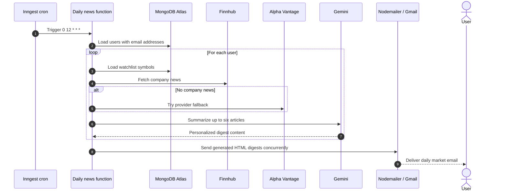
```mermaid
sequenceDiagram
    autonumber
    participant Clock as Inngest cron
    participant Job as Daily news function
    participant Mongo as MongoDB Atlas
    participant Finnhub
    participant Alpha as Alpha Vantage
    participant Gemini
    participant Mail as Nodemailer / Gmail
    actor User

    Clock->>Job: Trigger 0 12 * * *
    Job->>Mongo: Load users with email addresses
    loop For each user
        Job->>Mongo: Load watchlist symbols
        Job->>Finnhub: Fetch company news
        alt No company news
            Job->>Alpha: Try provider fallback
        end
        Job->>Gemini: Summarize up to six articles
        Gemini-->>Job: Personalized digest content
    end
    Job->>Mail: Send generated HTML digests concurrently
    Mail-->>User: Deliver daily market email
```

### Watchlist activity diagram

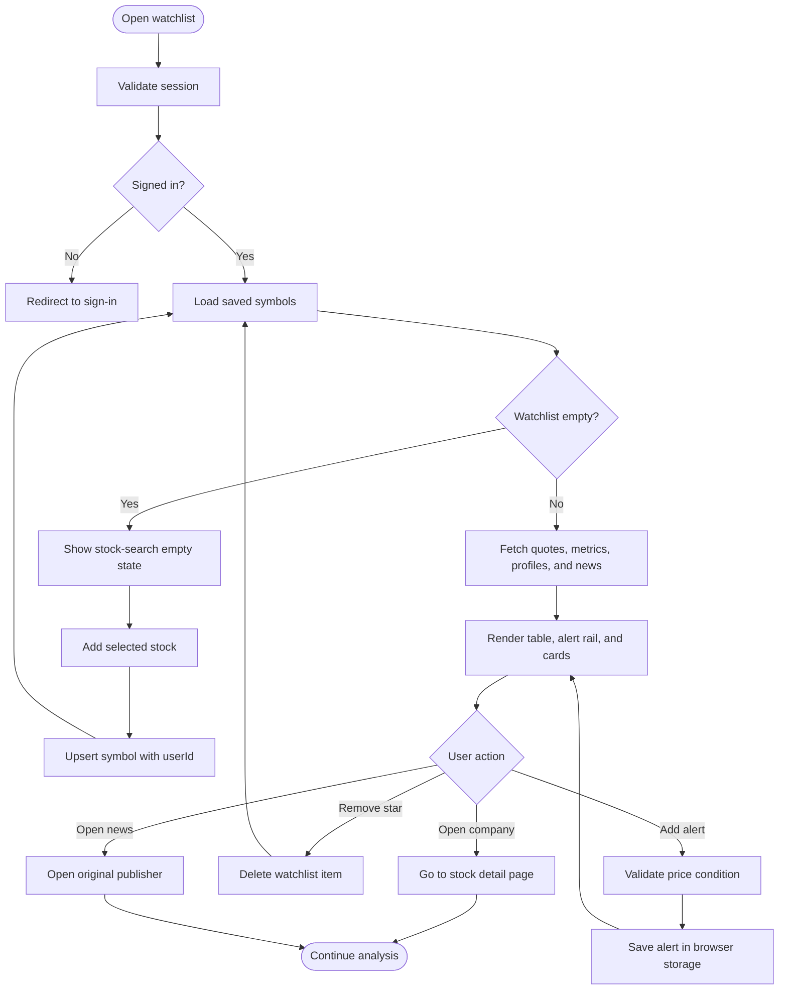
```mermaid
flowchart TD
    Start([Open watchlist]) --> Authenticate[Validate session]
    Authenticate --> SignedIn{Signed in?}
    SignedIn -- No --> SignIn[Redirect to sign-in]
    SignedIn -- Yes --> Load[Load saved symbols]
    Load --> Empty{Watchlist empty?}
    Empty -- Yes --> Search[Show stock-search empty state]
    Search --> Add[Add selected stock]
    Add --> Upsert[Upsert symbol with userId]
    Upsert --> Load
    Empty -- No --> Parallel[Fetch quotes, metrics, profiles, and news]
    Parallel --> Render[Render table, alert rail, and cards]
    Render --> Choice{User action}
    Choice -- Open company --> Details[Go to stock detail page]
    Choice -- Remove star --> Delete[Delete watchlist item]
    Choice -- Add alert --> Rule[Validate price condition]
    Rule --> Local[Save alert in browser storage]
    Choice -- Open news --> Publisher[Open original publisher]
    Details --> End([Continue analysis])
    Delete --> Load
    Local --> Render
    Publisher --> End
```

## UML-style diagrams

### Class diagram

This diagram shows the major responsibilities rather than every framework-generated class.

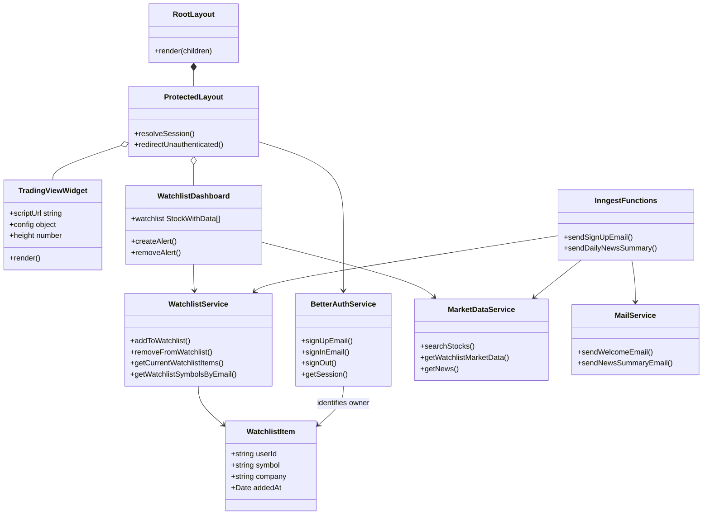
```mermaid
classDiagram
    class RootLayout {
        +render(children)
    }
    class ProtectedLayout {
        +resolveSession()
        +redirectUnauthenticated()
    }
    class TradingViewWidget {
        +scriptUrl string
        +config object
        +height number
        +render()
    }
    class WatchlistDashboard {
        +watchlist StockWithData[]
        +createAlert()
        +removeAlert()
    }
    class BetterAuthService {
        +signUpEmail()
        +signInEmail()
        +signOut()
        +getSession()
    }
    class WatchlistService {
        +addToWatchlist()
        +removeFromWatchlist()
        +getCurrentWatchlistItems()
        +getWatchlistSymbolsByEmail()
    }
    class MarketDataService {
        +searchStocks()
        +getWatchlistMarketData()
        +getNews()
    }
    class InngestFunctions {
        +sendSignUpEmail()
        +sendDailyNewsSummary()
    }
    class MailService {
        +sendWelcomeEmail()
        +sendNewsSummaryEmail()
    }
    class WatchlistItem {
        +string userId
        +string symbol
        +string company
        +Date addedAt
    }

    RootLayout *-- ProtectedLayout
    ProtectedLayout --> BetterAuthService
    ProtectedLayout o-- TradingViewWidget
    ProtectedLayout o-- WatchlistDashboard
    WatchlistDashboard --> WatchlistService
    WatchlistDashboard --> MarketDataService
    WatchlistService --> WatchlistItem
    BetterAuthService --> WatchlistItem : identifies owner
    InngestFunctions --> WatchlistService
    InngestFunctions --> MarketDataService
    InngestFunctions --> MailService
```

### Object diagram

The following is an example runtime snapshot after an authenticated user opens a watchlist containing Apple.

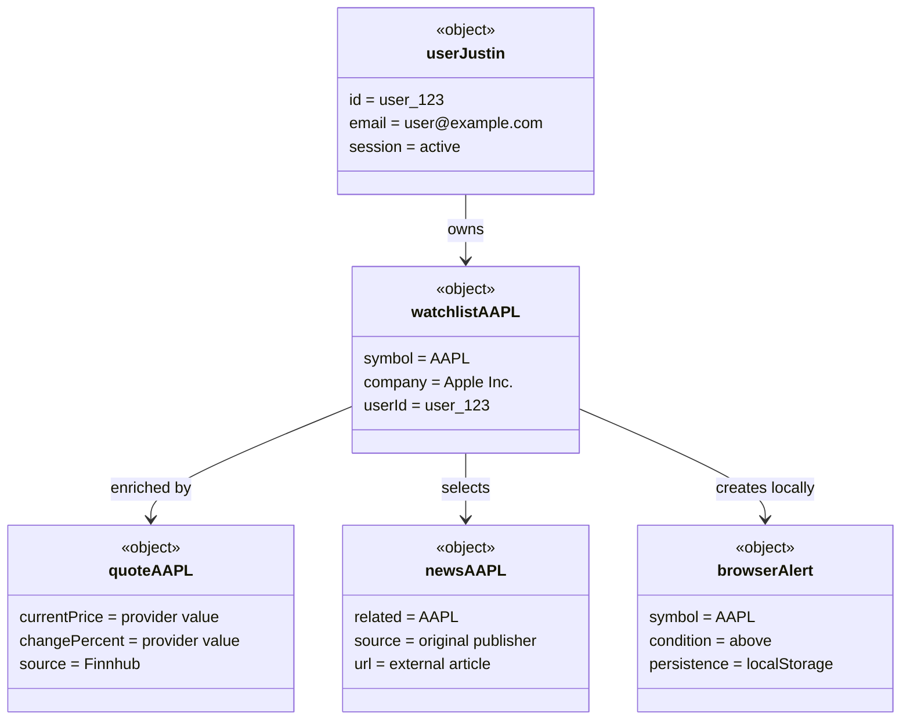
```mermaid
classDiagram
    class userJustin {
        <<object>>
        id = user_123
        email = user@example.com
        session = active
    }
    class watchlistAAPL {
        <<object>>
        symbol = AAPL
        company = Apple Inc.
        userId = user_123
    }
    class quoteAAPL {
        <<object>>
        currentPrice = provider value
        changePercent = provider value
        source = Finnhub
    }
    class newsAAPL {
        <<object>>
        related = AAPL
        source = original publisher
        url = external article
    }
    class browserAlert {
        <<object>>
        symbol = AAPL
        condition = above
        persistence = localStorage
    }

    userJustin --> watchlistAAPL : owns
    watchlistAAPL --> quoteAAPL : enriched by
    watchlistAAPL --> newsAAPL : selects
    watchlistAAPL --> browserAlert : creates locally
```

### Entity relationship diagram

Better Auth manages its own MongoDB collections. Signalist's application-owned `watchlists` collection stores the relationship between a user and a tracked stock.

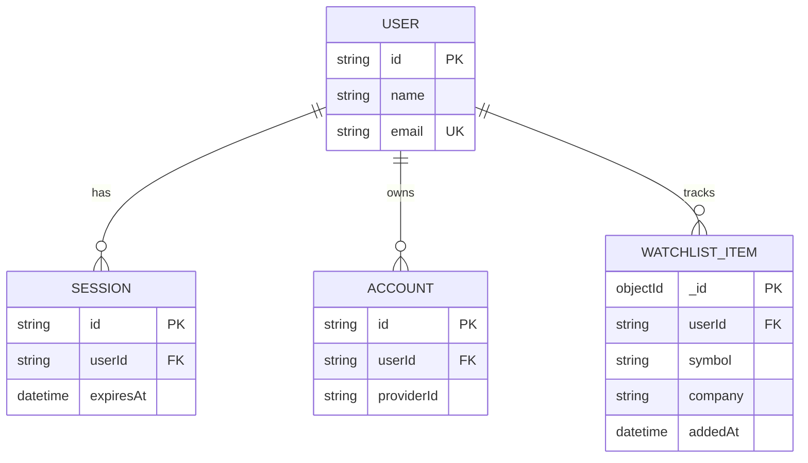
```mermaid
erDiagram
    USER ||--o{ SESSION : has
    USER ||--o{ ACCOUNT : owns
    USER ||--o{ WATCHLIST_ITEM : tracks

    USER {
        string id PK
        string name
        string email UK
    }
    SESSION {
        string id PK
        string userId FK
        datetime expiresAt
    }
    ACCOUNT {
        string id PK
        string userId FK
        string providerId
    }
    WATCHLIST_ITEM {
        objectId _id PK
        string userId FK
        string symbol
        string company
        datetime addedAt
    }
```

`WATCHLIST_ITEM` enforces a unique compound index on `(userId, symbol)`, preventing a user from saving the same stock twice.

### Background-job state diagram

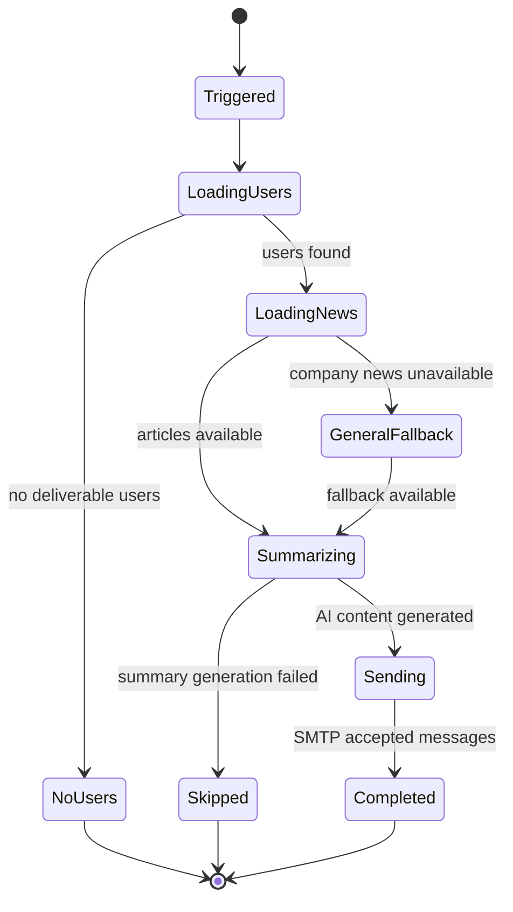
```mermaid
stateDiagram-v2
    [*] --> Triggered
    Triggered --> LoadingUsers
    LoadingUsers --> NoUsers: no deliverable users
    LoadingUsers --> LoadingNews: users found
    LoadingNews --> Summarizing: articles available
    LoadingNews --> GeneralFallback: company news unavailable
    GeneralFallback --> Summarizing: fallback available
    Summarizing --> Sending: AI content generated
    Summarizing --> Skipped: summary generation failed
    Sending --> Completed: SMTP accepted messages
    NoUsers --> [*]
    Skipped --> [*]
    Completed --> [*]
```

### Deployment view

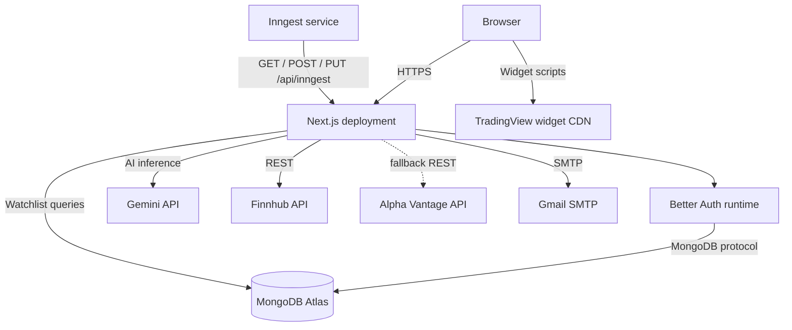
```mermaid
flowchart TB
    Browser[Browser]
    Next[Next.js deployment]
    Mongo[(MongoDB Atlas)]
    Better[Better Auth runtime]
    InngestCloud[Inngest service]
    GeminiAPI[Gemini API]
    FinnhubAPI[Finnhub API]
    AlphaAPI[Alpha Vantage API]
    TVCDN[TradingView widget CDN]
    GmailSMTP[Gmail SMTP]

    Browser -->|HTTPS| Next
    Browser -->|Widget scripts| TVCDN
    Next --> Better
    Better -->|MongoDB protocol| Mongo
    Next -->|Watchlist queries| Mongo
    Next -->|REST| FinnhubAPI
    Next -. fallback REST .-> AlphaAPI
    InngestCloud -->|GET / POST / PUT /api/inngest| Next
    Next -->|AI inference| GeminiAPI
    Next -->|SMTP| GmailSMTP
```

## External integrations

### TradingView

TradingView is used for visualization rather than as the application database. `TradingViewWidget` delegates script lifecycle management to `useTradingViewWidget`, which:

1. Creates the widget target inside a React ref.
2. Loads the requested TradingView embed script asynchronously.
3. Serializes the central configuration object into the script body.
4. Avoids duplicate widget loading through a `data-loaded` marker.
5. Cleans up the generated embed when the component unmounts.

Widget configuration lives in `lib/constants.ts`, keeping route components focused on layout.

### shadcn/ui and Radix UI

The UI primitives in `components/ui` provide accessible behavior for dialogs, command search, dropdowns, popovers, selects, inputs, avatars, and buttons. Signalist composes these primitives into domain components such as stock search, user navigation, and price-alert creation while applying its own dark financial-dashboard theme.

### Better Auth

Better Auth uses its MongoDB adapter and supports email/password accounts with automatic sign-in after registration. The project exposes Better Auth through `/api/auth/[...all]`. Middleware checks for the session cookie before protected routes render, while the protected root layout performs the authoritative server-side session lookup.

### MongoDB Atlas and Mongoose

MongoDB Atlas stores authentication data and watchlist items. The connection helper caches both the resolved connection and an in-progress promise, avoiding unnecessary connections during Next.js hot reloads and repeated server calls.

The watchlist model normalizes symbols to uppercase and uses a compound unique index to make add operations idempotent.

### Finnhub and Alpha Vantage

Finnhub is the primary market-data provider. It supplies:

- Stock and company lookup
- Company profiles
- Current quotes
- Basic financial metrics
- Company news
- General market news

Alpha Vantage is the resilience fallback for two Finnhub-dependent paths:

- **Company news:** for every watchlist symbol, Signalist calls Finnhub first. If the request fails or Finnhub returns no valid articles, it requests that symbol's `NEWS_SENTIMENT` feed from Alpha Vantage. If no personalized articles can be collected at all, the app falls through to Finnhub's general-market news endpoint.
- **Indian-market search:** Signalist recognizes BSE/NSE and common `.BO`, `.BSE`, `.NS`, and `.NSE` suffixes. When Finnhub returns no Indian-market result for a typed search—or its search request fails—the app queries Alpha Vantage's symbol search and keeps Indian-market matches.

This fallback is intentionally scoped. Finnhub remains the primary source for quote, company-profile, and valuation-metric enrichment; Alpha Vantage keeps stock discovery and relevant news usable when Finnhub company-news/search data is unavailable.

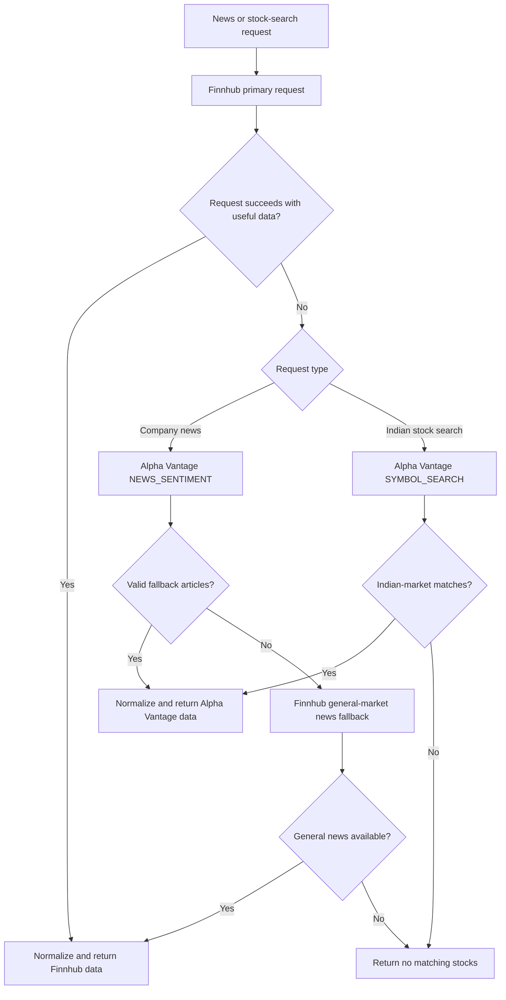
```mermaid
flowchart TD
    Request[News or stock-search request] --> Finnhub[Finnhub primary request]
    Finnhub --> Success{Request succeeds with useful data?}
    Success -- Yes --> UseFinnhub[Normalize and return Finnhub data]
    Success -- No --> Kind{Request type}
    Kind -- Company news --> AlphaNews[Alpha Vantage NEWS_SENTIMENT]
    Kind -- Indian stock search --> AlphaSearch[Alpha Vantage SYMBOL_SEARCH]
    AlphaNews --> AlphaResult{Valid fallback articles?}
    AlphaSearch --> SearchResult{Indian-market matches?}
    AlphaResult -- Yes --> UseAlpha[Normalize and return Alpha Vantage data]
    SearchResult -- Yes --> UseAlpha
    AlphaResult -- No --> General[Finnhub general-market news fallback]
    SearchResult -- No --> Empty[Return no matching stocks]
    General --> NewsResult{General news available?}
    NewsResult -- Yes --> UseFinnhub
    NewsResult -- No --> Empty
```

### Inngest

Inngest handles long-running and scheduled work away from interactive page requests. Two functions are registered at `/api/inngest`:

- `sign-up-email` listens for `app/user.created`.
- `daily-news-summary` listens for `app/send.daily.news` and the cron schedule `0 12 * * *`.

Individual `step.run` and `step.ai.infer` boundaries make expensive work observable and retriable by the Inngest runtime.

### Gemini

Gemini is accessed through Inngest's AI step support. It generates a welcome introduction from the registration profile and summarizes market articles for each user's daily digest. A plain welcome message is used when generated welcome content is unavailable.

### Nodemailer

Nodemailer uses Gmail SMTP credentials from the environment. Mail functions populate reusable HTML templates for:

- Personalized welcome emails
- Daily market-news summaries

Keeping SMTP in the background workflow prevents email latency from delaying sign-up or page rendering.

## Project structure

```text
stocktracking/
├── app/
│   ├── (auth)/                 # Sign-in and sign-up routes
│   ├── (root)/                 # Protected dashboard, watchlist, and stock pages
│   ├── api/auth/[...all]/      # Better Auth route handler
│   ├── api/inngest/            # Inngest function endpoint
│   ├── globals.css             # Theme, responsive layouts, and ticker animation
│   └── layout.tsx              # Global fonts, metadata, and toast provider
├── components/
│   ├── forms/                  # Reusable typed form fields
│   ├── ui/                     # shadcn/Radix primitives
│   ├── MarketNewsBar.tsx       # Personalized scrolling news ticker
│   ├── TradingViewWidget.tsx   # Reusable TradingView embed boundary
│   ├── WatchlistDashboard.tsx  # Market table and browser price alerts
│   └── WatchlistNews.tsx       # Personalized news-card grid
├── database/
│   ├── models/watchlist.model.ts
│   └── mongoose.ts             # Cached MongoDB connection
├── hooks/
│   ├── useDebounce.ts
│   └── useTradingViewWidget.tsx
├── lib/
│   ├── actions/                # Authentication, users, watchlist, and market data
│   ├── better-auth/            # Server-side Better Auth configuration
│   ├── inngest/                # Client, workflows, and AI prompts
│   ├── nodemailer/             # SMTP service and HTML templates
│   ├── auth-client.ts
│   ├── constants.ts            # Widget configs and shared constants
│   └── utils.ts
├── public/readme/              # README screenshots and diagrams
├── scripts/                    # Database verification helpers
├── types/global.d.ts           # Application-wide TypeScript contracts
└── middleware.ts               # Protected-route cookie gate
```

## Getting started

### Prerequisites

- Node.js 20 or newer
- npm
- A MongoDB Atlas database
- Better Auth secret
- Finnhub API key
- Alpha Vantage key for fallback support
- Inngest account or local Inngest development environment
- Gemini API key
- Gmail address and application password for Nodemailer

### Installation

```bash
git clone <your-repository-url>
cd stocktracking
npm install
```

Copy the example environment file and fill in your own credentials:

```bash
cp .env.example .env
```

On Windows PowerShell:

```powershell
Copy-Item .env.example .env
```

Start the development server:

```bash
npm run dev
```

Open [http://localhost:3000](http://localhost:3000).

For scheduled functions, connect Inngest to the application's `/api/inngest` endpoint. In production, ensure the deployed URL is reachable by Inngest.

## Environment variables

| Variable | Required | Purpose |
| --- | --- | --- |
| `NODE_ENV` | Yes | Runtime environment, usually `development` or `production` |
| `NEXT_PUBLIC_BASE_URL` | Yes | Browser-facing application base URL |
| `FINNHUB_API_KEY` | Yes | Server-side Finnhub access for quotes, profiles, metrics, search, and news |
| `NEXT_PUBLIC_FINNHUB_API_KEY` | Fallback | Compatibility fallback when the server key is absent; server-only keys are preferred |
| `ALPHA_VANTAGE_API_KEY` | Recommended | Indian-market search and news fallback |
| `ALPHA_VANTAGE_BASE_URL` | No | Overrides the default Alpha Vantage endpoint |
| `MONGODB_URI` | Yes | MongoDB Atlas connection string |
| `BETTER_AUTH_SECRET` | Yes | Signs and protects Better Auth state |
| `BETTER_AUTH_URL` | Yes | Canonical Better Auth application URL |
| `GEMINI_API_KEY` | Yes for AI email | Gemini access used by Inngest AI steps |
| `NODEMAILER_EMAIL` | Yes for email | Gmail account used for SMTP authentication |
| `NODEMAILER_PASSWORD` | Yes for email | Gmail application password, not the normal account password |

Never commit `.env` or production credentials. Keep API keys server-side whenever the provider and architecture permit it.

## Background jobs and email

### Welcome workflow

1. The sign-up page calls the Better Auth client, which creates the account and session through `/api/auth/[...all]`.
2. After success, the page invokes `sendSignUpEvent`, which emits `app/user.created` with the non-password profile fields.
3. Inngest asks Gemini to generate a tailored introduction.
4. Nodemailer renders the welcome template.
5. Gmail SMTP delivers the message.

The password is not included in the Inngest event.

### Daily digest workflow

1. A cron or `app/send.daily.news` event starts the function.
2. The workflow loads users that have deliverable email addresses.
3. It loads each user's watchlist symbols.
4. It gathers up to six relevant articles, falling back to general news when required.
5. Gemini produces a compact personalized summary.
6. Nodemailer sends completed summaries concurrently.

## Data model

### Watchlist item

```ts
{
  userId: string;
  symbol: string;   // uppercase and trimmed
  company: string;
  addedAt: Date;
}
```

Quote values, metrics, and articles are fetched on demand and are not duplicated in the watchlist collection. Browser price-alert rules are currently stored separately in `localStorage` under `signalist-watchlist-alerts`.

## Security and reliability

- Protected routes are screened by middleware and validated again through a server-side Better Auth session lookup.
- Passwords are handled by Better Auth and are never sent to Inngest.
- Watchlist reads and writes derive the user identity from the server session rather than accepting a client-provided user ID.
- The `(userId, symbol)` unique index prevents duplicate watchlist records.
- MongoDB connections are cached to reduce connection churn.
- Market requests use explicit cache and revalidation windows appropriate to the data type.
- External news is validated before being formatted and rendered.
- Background jobs isolate AI and SMTP failures from primary page requests.
- Credentials belong only in environment variables and must never be exposed in screenshots, logs, or source control.

For production hardening, add rate limiting to authentication and mutation endpoints, configure strict security headers, sanitize any AI-produced HTML before email rendering, and use a dedicated transactional email provider if delivery volume grows.

## Available scripts

| Command | Purpose |
| --- | --- |
| `npm run dev` | Start the Next.js development server |
| `npm run build` | Create an optimized production build |
| `npm run start` | Serve the production build |
| `npm run lint` | Run ESLint |
| `npm run test:db` | Verify the MongoDB connection with the included script |
| `npx tsc --noEmit` | Run an explicit TypeScript type check |

## Known limitations

- Browser price alerts define and display rules but do not yet execute as server-side notification jobs.
- Email delivery currently depends on Gmail SMTP configuration and provider limits.
- Market-data availability and rate limits depend on the configured Finnhub and Alpha Vantage plans.
- TradingView widgets require client-side network access to TradingView's embed scripts.
- The daily digest processes users sequentially while gathering articles, then sends prepared emails concurrently.
- Automated end-to-end browser tests are not currently included.

## Roadmap

- Persist alert rules in MongoDB and evaluate them through scheduled Inngest jobs.
- Add email or push delivery when price thresholds are crossed.
- Add watchlist sorting, filtering, pagination, and custom groups.
- Add portfolio positions, profit/loss tracking, and allocation charts.
- Add end-to-end tests for authentication, watchlist mutations, and email workflows.
- Add provider observability, retry dashboards, and rate-limit monitoring.
- Add configurable digest schedules and user notification preferences.

## License

No license has been declared yet. Add a `LICENSE` file before distributing or accepting external contributions.
